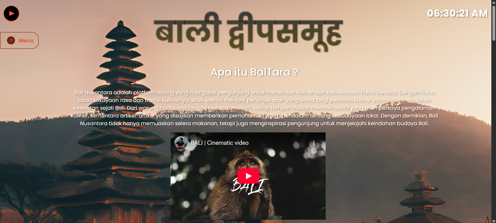

# BalTara (Bali Nusantara)


## Description
Bali Nusantara is a React-based web application designed to immerse users in the culture of Bali, Indonesia. It serves as a comprehensive digital guide for food reccomendations, featuring:
* **Curated Video Content:** Dynamic video feeds powered by the YouTube Data API.
* **Geographic Context:** Interactive maps highlighting location of the given food via Google Maps.
* **Culinary Heritage:** A catalog of traditional Balinese foods, sourced from a custom JSON data repository.

**Target Audience:** Tourists, cultural enthusiasts, and researchers looking for a centralized platform to explore Balinese culture, geography, and cuisine.


[**Live Production Site**](http://baltara.me)

## Table of Contents
- [Description](#description)
- [Architecture](#architecture)
- [Prerequisites](#prerequisites)
- [Installation](#installation)
- [Configuration](#configuration)
- [Usage](#usage)
- [Deployment](#deployment)

## Architecture

**Core Framework:**
* **Frontend:** React (v18.3.1)
* **Routing:** React Router DOM (v6.x)
* **Build Tool:** Create React App

**Data Sources & APIs:**
* **Video Content:** Google YouTube Data API v3
* **Maps & Location:** Google Maps JavaScript API
* **Culinary Data:** Static JSON API (Hosted on GitHub)

**UI & Styling:**
* **Framework:** Bootstrap (v5.3.3) & React-Bootstrap
* **Components:** Swiper (Carousel), SweetAlert2 (Modals)
* **Visuals:** React Wavify

## Prerequisites
Ensure the following tools are installed in your development environment:
* **Node.js**: v18.x or v20.x (LTS recommended)
* **npm**: v9.x or higher
* **Git**

## Installation

1.  **Clone the repository**
    ```bash
    git clone [https://github.com/Liment1/BalTara.git](https://github.com/Liment1/BalTara.git)
    cd BalTara
    ```

2.  **Install dependencies**
    ```bash
    npm install
    ```

## Configuration

This application requires API keys for Google services.

1.  **Create Environment File:**
    ```bash
    touch .env
    ```

2.  **Add API Keys:**
    Open `.env` and add your keys (prefix `REACT_APP_` is required):
    ```env
    REACT_APP_YOUTUBE_API_KEY=your_youtube_key_here
    REACT_APP_MAPS_API_KEY=your_maps_key_here
    ```
    *(Note: The Food Data JSON source is public and does not require an API key.)*

## Usage

**Development Server**
Runs the app in development mode.
```bash
npm start
```

## Deployment

This project is configured for continuous deployment using **GitHub Pages**.

**Configuration Details:**
* **Source Branch:** `gh-pages` (automatically generated).
* **Custom Domain:** [baltara.me](http://baltara.me)
* **Workflow:** GitHub Actions (`pages-build-deployment`).

**How to Deploy Updates:**
1.  Ensure your changes are committed to the `main` branch.
2.  Run the deployment script:
    ```bash
    npm run deploy
    ```
3.  This script will:
    * Create a production build of the application.
    * Push the build artifacts to the `gh-pages` branch.
    * Trigger the GitHub Actions workflow to update the live site.

*Note: DNS changes for the custom domain may take a few minutes to propagate after the initial setup.*
